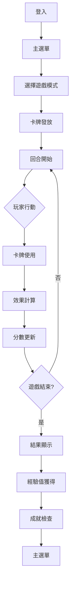
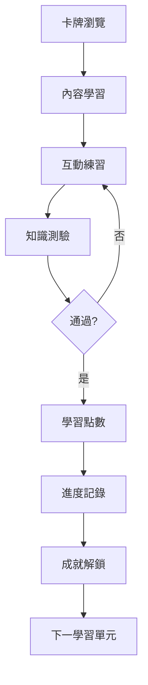

# 🏗️ ESG善向紀元 - 系統架構設計

## 📋 架構總覽

ESG善向紀元是一個基於React的前端Web應用，採用現代化架構設計，專注於ESG教育遊戲化體驗。

## 🏛️ 架構原則

### 設計哲學
- **模組化設計**：每個功能模組獨立開發、測試和部署
- **可擴展性**：架構支援快速功能迭代和規模擴張
- **使用者中心**：以學習體驗和參與度為核心設計考量
- **效能優先**：優化載入速度和運行效能

### 技術選擇依據
- **React + TypeScript**：類型安全、元件化開發、豐富生態
- **Vite**：快速建構、熱重載、現代化開發體驗
- **Tailwind CSS**：原子化CSS、響應式設計、一致性設計系統

## 🏗️ 系統架構圖

```
┌─────────────────────────────────────────────────────────────┐
│                    🎮 ESG善向紀元前端應用                     │
├─────────────────────────────────────────────────────────────┤
│  ┌─────────────┐ ┌─────────────┐ ┌─────────────────────┐     │
│  │  🎴 遊戲引擎 │ │  📚 內容管理 │ │  👤 使用者管理       │     │
│  │             │ │             │ │                     │     │
│  │ • 卡牌系統   │ │ • 卡牌資料庫 │ │ • 認證與授權       │     │
│  │ • 對戰邏輯   │ │ • 學習內容   │ │ • 個人資料         │     │
│  │ • 計分系統   │ │ • 媒體資源   │ │ • 學習進度         │     │
│  └─────────────┘ └─────────────┘ └─────────────────────┘     │
├─────────────────────────────────────────────────────────────┤
│  ┌─────────────┐ ┌─────────────┐ ┌─────────────────────┐     │
│  │  🔧 服務層  │ │  📊 分析層  │ │  🛡️ 安全層          │     │
│  │             │ │             │ │                     │     │
│  │ • API服務    │ │ • 使用者行為 │ │ • 認證服務         │     │
│  │ • 快取管理   │ │ • 學習分析   │ │ • 資料加密         │     │
│  │ • 配置管理   │ │ • 效能監控   │ │ • 輸入驗證         │     │
│  └─────────────┘ └─────────────┘ └─────────────────────┘     │
├─────────────────────────────────────────────────────────────┤
│  ┌─────────────┐ ┌─────────────┐ ┌─────────────────────┐     │
│  │  🎨 UI層    │ │  📱 UX層    │ │  🌐 整合層          │     │
│  │             │ │             │ │                     │     │
│  │ • 元件庫     │ │ • 互動設計   │ │ • 外部API         │     │
│  │ • 設計系統   │ │ • 使用者流程 │ │ • 第三方服務       │     │
│  │ • 響應式佈局 │ │ • 無障礙設計 │ │ • 資料同步         │     │
│  └─────────────┘ └─────────────┘ └─────────────────────┘     │
├─────────────────────────────────────────────────────────────┤
│  ┌─────────────────────────────────────────────────────┐     │
│  │                 🔧 開發工具與基礎設施                │     │
│  │                                                     │     │
│  │ • TypeScript • ESLint • Prettier • Vitest • Vite   │     │
│  │ • GitHub Actions • Docker • CI/CD • 監控工具        │     │
│  └─────────────────────────────────────────────────────┘     │
└─────────────────────────────────────────────────────────────┘
```

## 📁 目錄結構

```
esg-good-era/
├── 📁 components/           # React元件
│   ├── 📁 ui/              # 基礎UI元件
│   ├── 📁 providers/       # Context Providers
│   ├── 📁 hoc/            # 高階元件
│   └── 📁 minimal/        # 輕量化元件
├── 📁 services/            # 業務服務層
│   ├── auth.ts            # 認證服務
│   ├── analytics.ts       # 分析服務
│   ├── monitoring.ts      # 監控服務
│   ├── scalability.ts     # 擴展性服務
│   └── esg.ts            # ESG計算服務
├── 📁 contexts/           # React Context
├── 📁 hooks/             # 自訂Hooks
├── 📁 src/
│   ├── 📁 config/        # 配置管理
│   ├── 📁 utils/         # 工具函數
│   └── 📁 test/          # 測試文件
├── 📁 coverage/          # 測試覆蓋率報告
├── 📁 scripts/           # 建構與部署腳本
└── 📁 .github/           # GitHub Actions
```

## 🔧 核心模組設計

### 1. 遊戲引擎模組 (Game Engine)
**責任**：處理遊戲邏輯、卡牌系統、對戰機制
**設計模式**：狀態機模式、策略模式
**關鍵類別**：
- `GameEngine` - 遊戲主要邏輯控制器
- `CardSystem` - 卡牌管理系統
- `BattleSystem` - 對戰規則引擎
- `ScoringSystem` - 計分與成就系統

### 2. 內容管理模組 (Content Management)
**責任**：卡牌內容、學習資源、媒體管理
**設計模式**：工廠模式、倉儲模式
**關鍵類別**：
- `CardFactory` - 卡牌建立工廠
- `ContentRepository` - 內容資料倉儲
- `AssetManager` - 資源載入管理器

### 3. 使用者管理模組 (User Management)
**責任**：使用者資料、學習進度、個人化設定
**設計模式**：觀察者模式、策略模式
**關鍵類別**：
- `UserProfile` - 使用者資料管理
- `ProgressTracker` - 學習進度追蹤
- `AchievementSystem` - 成就與徽章系統

## 🗂️ 資料架構設計

### 狀態管理策略
```
全域狀態 (Context API)
├── 🎮 遊戲狀態
│   ├── 當前遊戲狀態
│   ├── 卡牌狀態
│   └── 玩家狀態
├── 👤 使用者狀態
│   ├── 認證狀態
│   ├── 個人資料
│   └── 學習記錄
├── 🎨 UI狀態
│   ├── 主題設定
│   ├── 語言設定
│   └── 介面偏好
└── 📊 分析狀態
    ├── 使用者行為
    ├── 學習指標
    └── 系統效能
```

### 資料流設計
```
使用者互動 → 元件事件 → Hook處理 → 服務調用 → 狀態更新 → UI重新渲染
    ↓           ↓         ↓        ↓         ↓          ↓
錯誤處理 ← 異常捕獲 ← 服務錯誤 ← API失敗 ← 網路錯誤 ← 系統異常
```

## 🔄 系統流程設計

### 遊戲流程


### 學習流程


## 🛡️ 安全架構

### 前端安全措施
- **輸入驗證**：所有使用者輸入進行嚴格驗證
- **XSS防護**：HTML清理和內容安全策略
- **CSRF保護**：請求標頭驗證和token機制
- **資料加密**：敏感資料使用AES加密儲存

### 認證與授權
- **JWT Token**：無狀態認證機制
- **角色權限**：細粒度權限控制
- **會話管理**：安全會話生命週期管理

## 📊 效能優化策略

### 載入效能
- **程式碼分割**：路由級別程式碼分割
- **資源優化**：圖片壓縮、字體子集化
- **快取策略**：Service Worker快取策略
- **懶載入**：元件和資源按需載入

### 運行效能
- **虛擬化**：長列表虛擬化渲染
- **記憶化**：元件和計算結果記憶化
- **批量更新**：狀態更新批量處理
- **資源池**：連線和資源池管理

## 🔧 部署與運維

### CI/CD流程
```bash
原始碼 → 程式碼檢查 → 單元測試 → 建構 → 整合測試 → 部署 → 監控
```

### 環境配置
- **開發環境**：本地開發和測試
- **預發環境**：整合測試和驗收測試
- **生產環境**：最終使用者環境

### 監控與告警
- **應用監控**：效能指標和錯誤追蹤
- **基礎設施監控**：系統資源和服務健康
- **使用者體驗監控**：Core Web Vitals和互動指標

## 📈 擴展性設計

### 水平擴展
- **微服務架構**：功能模組獨立部署
- **負載均衡**：多實例分散處理
- **資料分片**：資料庫水平分割

### 垂直擴展
- **快取階層**：多級快取策略
- **資料庫優化**：索引優化和查詢優化
- **CDN整合**：靜態資源全球分發

## 🎯 架構演進規劃

### Phase 1: 單體應用 (當前)
- 前後端一體化架構
- 本地儲存和狀態管理
- 靜態資源直接服務

### Phase 2: 微服務準備
- API層與前端分離
- 資料持久化設計
- 第三方服務整合

### Phase 3: 分散式架構
- 微服務架構實現
- 容器化部署
- 雲原生設計

---

## 📚 參考文獻

- [React官方文件](https://react.dev/)
- [TypeScript手冊](https://www.typescriptlang.org/docs/)
- [Web性能優化指南](https://web.dev/)
- [可擴展Web架構](https://www.oreilly.com/library/view/scaling-frontend/9781098145136/)

---

**© 2025 ESG善向紀元開發團隊 | 持續架構優化中**