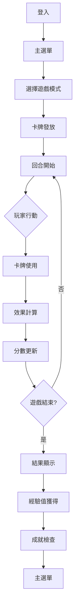
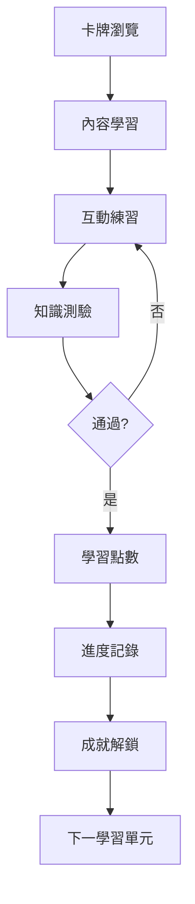
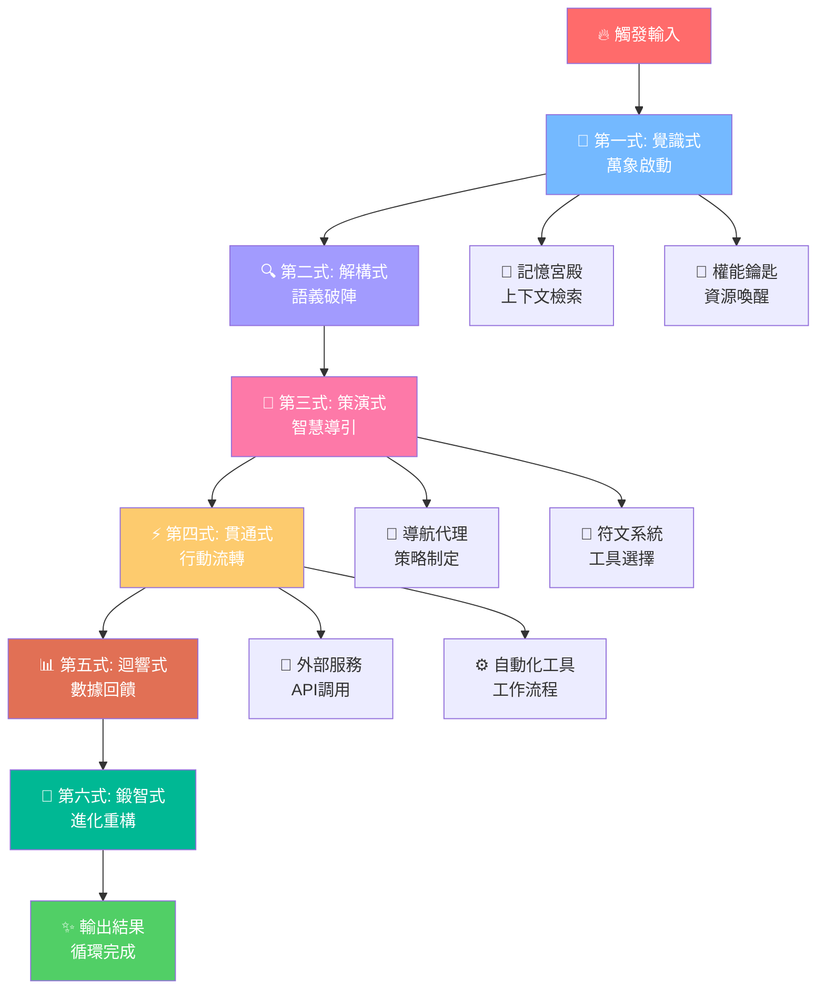

# 🏗️ ESG善向紀元 - 系統架構設計

## 📋 架構總覽

ESG善向紀元是一個基於React的前端Web應用，採用現代化架構設計，專注於ESG教育遊戲化體驗。

## 🏛️ 架構原則

### 設計哲學
- **模組化設計**：每個功能模組獨立開發、測試和部署
- **可擴展性**：架構支援快速功能迭代和規模擴張
- **使用者中心**：以學習體驗和參與度為核心設計考量
- **效能優先**：優化載入速度和運行效能

### 技術選擇依據
- **React + TypeScript**：類型安全、元件化開發、豐富生態
- **Vite**：快速建構、熱重載、現代化開發體驗
- **Tailwind CSS**：原子化CSS、響應式設計、一致性設計系統

## 🏗️ 系統架構圖

### 整體系統架構

```
┌─────────────────────────────────────────────────────────────────┐
│                    🎮 ESG善向紀元智慧系統                         │
├─────────────────────────────────────────────────────────────────┤
│  ┌─────────────────┐ ┌─────────────────────────────────────┐     │
│  │   🔑 Jun.AI.Key │ │        🎮 ESG前端應用                │     │
│  │  萬能元鑰系統   │ │                                   │     │
│  │                 │ │  ┌─────────────┐ ┌─────────────┐   │     │
│  │ • 永久記憶宮殿  │ │  │  🎴 遊戲引擎 │ │  📚 內容管理 │   │     │
│  │ • 自我導航代理群 │ │  │             │ │             │   │     │
│  │ • 權能冶煉引擎  │ │  │ • 卡牌系統   │ │ • 卡牌資料庫 │   │     │
│  │ • 符文嵌合系統  │ │  │ • 對戰邏輯   │ │ • 學習內容   │   │     │
│  │ • 六式奧義循環  │ │  │ • 計分系統   │ │ • 媒體資源   │   │     │
│  └─────────────────┘ └─────────────┘ └─────────────┘   │     │
├─────────────────────────────────────────────────────────────────┤
│  ┌─────────────┐ ┌─────────────┐ ┌─────────────────────┐       │
│  │  🔧 服務層  │ │  📊 分析層  │ │  🛡️ 安全層          │       │
│  │             │ │             │ │                     │       │
│  │ • API服務    │ │ • 使用者行為 │ │ • 認證服務         │       │
│  │ • 快取管理   │ │ • 學習分析   │ │ • 資料加密         │       │
│  │ • 配置管理   │ │ • 效能監控   │ │ • 輸入驗證         │       │
│  └─────────────┘ └─────────────┘ └─────────────────────┘       │
├─────────────────────────────────────────────────────────────────┤
│  ┌─────────────┐ ┌─────────────┐ ┌─────────────────────┐       │
│  │  🎨 UI層    │ │  📱 UX層    │ │  🌐 整合層          │       │
│  │             │ │             │ │                     │       │
│  │ • 元件庫     │ │ • 互動設計   │ │ • 外部API         │       │
│  │ • 設計系統   │ │ • 使用者流程 │ │ • 第三方服務       │       │
│  │ • 響應式佈局 │ │ • 無障礙設計 │ │ • 資料同步         │       │
│  └─────────────┘ └─────────────┘ └─────────────────────┘       │
├─────────────────────────────────────────────────────────────────┤
│  ┌─────────────────────────────────────────────────────┐       │
│  │                 🔧 開發工具與基礎設施                │       │
│  │                                                     │       │
│  │ • TypeScript • ESLint • Prettier • Vitest • Vite   │       │
│  │ • GitHub Actions • Docker • CI/CD • 監控工具        │       │
│  └─────────────────────────────────────────────────────┘       │
└─────────────────────────────────────────────────────────────────┘
```

### Jun.AI.Key 萬能元鑰系統架構

```
┌─────────────────────────────────────────────────────────────────┐
│                    🔑 Jun.AI.Key 萬能元鑰                         │
├─────────────────────────────────────────────────────────────────┤
│  ┌─────────────────┐ ┌─────────────────┐ ┌─────────────────┐     │
│  │ 🏰 記憶宮殿     │ │ 🤖 導航代理群   │ │ ⚙️ 權能冶煉引擎   │     │
│  │ Memory Palace   │ │ Navigation Agents│ │ Authority Forge │     │
│  │                 │ │                 │ │                 │     │
│  │ • 向量記憶庫     │ │ • 任務調度       │ │ • 行為學習       │     │
│  │ • 知識圖譜       │ │ • 策略規劃       │ │ • 權能鑰匙       │     │
│  │ • 聯想網路       │ │ • 協同執行       │ │ • 效能優化       │     │
│  └─────────────────┘ └─────────────────┘ └─────────────────┘     │
├─────────────────────────────────────────────────────────────────┤
│  ┌─────────────────┐ ┌─────────────────┐ ┌─────────────────┐     │
│  │ 🧬 符文嵌合系統 │ │ 🌪️ 六式奧義循環 │ │ 🔄 核心整合器    │     │
│  │ Rune Engrafting │ │ Mystic Forms    │ │ OmniKey Core    │     │
│  │                 │ │                 │ │                 │     │
│  │ • AI模型符文     │ │ 1.覺識式啟動    │ │ • 循環管理       │     │
│  │ • API服務符文    │ │ 2.解構式破陣    │ │ • 資源調度       │     │
│  │ • 工具符文       │ │ 3.策演式導引    │ │ • 狀態同步       │     │
│  │ • 協同增效       │ │ 4.貫通式流轉    │ │ • 效能監控       │     │
│  │ • 動態適應       │ │ 5.迴響式回饋    │ │ • 系統進化       │     │
│  │                 │ │ 6.鍛智式重構    │ └─────────────────┘     │
│  └─────────────────┘ └─────────────────┘                         │
├─────────────────────────────────────────────────────────────────┤
│  ┌─────────────────────────────────────────────────────────┐     │
│  │               🌐 外部系統整合                              │     │
│  │                                                         │     │
│  │ • Google Gemini • OpenAI GPT • GitHub API • Notion API │     │
│  │ • Make.com • Boost.space • Firebase • AWS Services     │     │
│  └─────────────────────────────────────────────────────────┘     │
└─────────────────────────────────────────────────────────────────┘
```
│  ┌─────────────┐ ┌─────────────┐ ┌─────────────────────┐     │
│  │  🎴 遊戲引擎 │ │  📚 內容管理 │ │  👤 使用者管理       │     │
│  │             │ │             │ │                     │     │
│  │ • 卡牌系統   │ │ • 卡牌資料庫 │ │ • 認證與授權       │     │
│  │ • 對戰邏輯   │ │ • 學習內容   │ │ • 個人資料         │     │
│  │ • 計分系統   │ │ • 媒體資源   │ │ • 學習進度         │     │
│  └─────────────┘ └─────────────┘ └─────────────────────┘     │
├─────────────────────────────────────────────────────────────┤
│  ┌─────────────┐ ┌─────────────┐ ┌─────────────────────┐     │
│  │  🔧 服務層  │ │  📊 分析層  │ │  🛡️ 安全層          │     │
│  │             │ │             │ │                     │     │
│  │ • API服務    │ │ • 使用者行為 │ │ • 認證服務         │     │
│  │ • 快取管理   │ │ • 學習分析   │ │ • 資料加密         │     │
│  │ • 配置管理   │ │ • 效能監控   │ │ • 輸入驗證         │     │
│  └─────────────┘ └─────────────┘ └─────────────────────┘     │
├─────────────────────────────────────────────────────────────┤
│  ┌─────────────┐ ┌─────────────┐ ┌─────────────────────┐     │
│  │  🎨 UI層    │ │  📱 UX層    │ │  🌐 整合層          │     │
│  │             │ │             │ │                     │     │
│  │ • 元件庫     │ │ • 互動設計   │ │ • 外部API         │     │
│  │ • 設計系統   │ │ • 使用者流程 │ │ • 第三方服務       │     │
│  │ • 響應式佈局 │ │ • 無障礙設計 │ │ • 資料同步         │     │
│  └─────────────┘ └─────────────┘ └─────────────────────┘     │
├─────────────────────────────────────────────────────────────┤
│  ┌─────────────────────────────────────────────────────┐     │
│  │                 🔧 開發工具與基礎設施                │     │
│  │                                                     │     │
│  │ • TypeScript • ESLint • Prettier • Vitest • Vite   │     │
│  │ • GitHub Actions • Docker • CI/CD • 監控工具        │     │
│  └─────────────────────────────────────────────────────┘     │
└─────────────────────────────────────────────────────────────┘
```

## 📁 目錄結構

```
esg-good-era/
├── 📁 components/           # React元件
│   ├── 📁 ui/              # 基礎UI元件
│   ├── 📁 providers/       # Context Providers
│   ├── 📁 hoc/            # 高階元件
│   ├── 📁 minimal/        # 輕量化元件
│   └── 📁 core/           # Jun.AI.Key 核心元件
├── 📁 services/            # 業務服務層
│   ├── auth.ts            # 認證服務
│   ├── analytics.ts       # 分析服務
│   ├── monitoring.ts      # 監控服務
│   ├── scalability.ts     # 擴展性服務
│   └── esg.ts            # ESG計算服務
├── 📁 contexts/           # React Context
├── 📁 hooks/             # 自訂Hooks
├── 📁 src/
│   ├── 📁 core/          # Jun.AI.Key 核心系統
│   │   ├── 📁 omnikey/   # 萬能元鑰主系統
│   │   │   ├── index.ts               # 主入口
│   │   │   ├── MemoryPalace.ts        # 永久記憶宮殿
│   │   │   ├── NavigationAgent.ts     # 自我導航代理群
│   │   │   ├── AuthorityForge.ts      # 權能冶煉引擎
│   │   │   ├── RuneEngrafter.ts       # 符文嵌合系統
│   │   │   ├── OmniKeyCore.ts         # 六式奧義循環
│   │   │   └── types.ts               # 類型定義
│   ├── 📁 config/        # 配置管理
│   ├── 📁 utils/         # 工具函數
│   └── 📁 test/          # 測試文件
│       └── 📁 omnikey/   # Jun.AI.Key 測試
├── 📁 coverage/          # 測試覆蓋率報告
├── 📁 scripts/           # 建構與部署腳本
└── 📁 .github/           # GitHub Actions
```

## 🔧 核心模組設計

### ESG前端應用模組

#### 1. 遊戲引擎模組 (Game Engine)
**責任**：處理遊戲邏輯、卡牌系統、對戰機制
**設計模式**：狀態機模式、策略模式
**關鍵類別**：
- `GameEngine` - 遊戲主要邏輯控制器
- `CardSystem` - 卡牌管理系統
- `BattleSystem` - 對戰規則引擎
- `ScoringSystem` - 計分與成就系統

#### 2. 內容管理模組 (Content Management)
**責任**：卡牌內容、學習資源、媒體管理
**設計模式**：工廠模式、倉儲模式
**關鍵類別**：
- `CardFactory` - 卡牌建立工廠
- `ContentRepository` - 內容資料倉儲
- `AssetManager` - 資源載入管理器

#### 3. 使用者管理模組 (User Management)
**責任**：使用者資料、學習進度、個人化設定
**設計模式**：觀察者模式、策略模式
**關鍵類別**：
- `UserProfile` - 使用者資料管理
- `ProgressTracker` - 學習進度追蹤
- `AchievementSystem` - 成就與徽章系統

### Jun.AI.Key 萬能元鑰系統模組

#### 4. 永久記憶宮殿 (Memory Palace)
**責任**：實現長期記憶儲存、知識圖譜管理、聯想網路建構
**設計模式**：倉儲模式、圖形資料庫模式、向量搜尋模式
**關鍵功能**：
- **向量記憶庫**：使用向量嵌入技術儲存和檢索知識
- **知識圖譜**：建立概念之間的語義關聯網路
- **聯想網路**：基於使用模式動態建立記憶聯想
- **學習強化**：通過重複使用和成功經驗增強記憶強度

**關鍵類別**：
- `MemoryPalace` - 主要記憶管理控制器
- `MemoryNode` - 記憶節點資料結構
- `AssociationNetwork` - 聯想網路管理器
- `VectorStore` - 向量儲存和檢索引擎

#### 5. 自我導航代理群 (Navigation Agents)
**責任**：實現自主任務調度、策略規劃、多代理協同
**設計模式**：代理模式、策略模式、狀態機模式
**關鍵功能**：
- **任務分析**：自動解析用戶意圖和需求
- **策略規劃**：基於歷史經驗制定執行策略
- **資源調度**：動態分配和協調各種資源
- **進度追蹤**：實時監控任務執行狀態

**關鍵類別**：
- `NavigationAgent` - 主要代理控制器
- `Task` - 任務資料結構和生命週期管理
- `StrategyPlanner` - 策略規劃引擎
- `ResourceCoordinator` - 資源協調管理器

#### 6. 權能冶煉引擎 (Authority Forge)
**責任**：通過行為學習和效能分析，動態鍛造權能鑰匙
**設計模式**：學習器模式、工廠模式、觀察者模式
**關鍵功能**：
- **行為學習**：分析用戶行為模式和偏好
- **效能評估**：量化各種操作的效率和效果
- **權能鑰匙鍛造**：基於學習結果生成優化策略
- **動態適應**：根據環境變化調整權能鑰匙

**關鍵類別**：
- `AuthorityForge` - 主要權能鍛造控制器
- `AuthorityKey` - 權能鑰匙資料結構
- `BehaviorAnalyzer` - 行為分析引擎
- `PerformanceEvaluator` - 效能評估器

#### 7. 符文嵌合系統 (Rune Engrafting)
**責任**：整合外部AI服務、API工具和自動化平台
**設計模式**：適配器模式、外觀模式、裝飾器模式
**關鍵功能**：
- **符文註冊**：註冊和管理各種外部服務和工具
- **動態嵌合**：根據任務需求選擇和組合符文
- **協同增效**：分析符文間的相容性和增效效果
- **效能優化**：動態調整符文配置以提升效率

**關鍵類別**：
- `RuneEngrafter` - 符文嵌合控制器
- `Rune` - 符文資料結構
- `EngraftedRune` - 嵌合符文實例
- `SynergyCalculator` - 協同增效計算器

#### 8. 六式奧義循環系統 (Mystic Forms Cycle)
**責任**：實現完整的任務執行循環，整合所有模組能力
**設計模式**：狀態機模式、模板方法模式、責任鏈模式
**六式奧義**：
1. **覺識式 (Awareness Activation)**：感知環境，喚醒相關記憶和資源
2. **解構式 (Semantic Decoding)**：解析意圖，提取關鍵信息和需求
3. **策演式 (Strategic Guidance)**：制定策略，規劃執行路徑
4. **貫通式 (Flow Execution)**：執行計劃，調度各種資源
5. **迴響式 (Echo Feedback)**：收集結果，反饋系統效能
6. **鍛智式 (Knowledge Refinement)**：優化系統，增強學習能力

**關鍵類別**：
- `OmniKeyCore` - 循環控制器
- `MysticCycle` - 循環實例
- `CycleResult` - 循環執行結果

#### 9. 萬能元鑰整合器 (OmniKey Integrator)
**責任**：提供統一API，協調所有模組間的互動
**設計模式**：外觀模式、單例模式、中介者模式
**關鍵功能**：
- **統一入口**：單一API訪問所有功能
- **資源管理**：集中管理系統資源和狀態
- **錯誤處理**：統一的異常處理和恢復機制
- **效能監控**：系統整體效能和健康狀態監控

**關鍵類別**：
- `JunAIKey` - 主要整合器類
- `SystemMonitor` - 系統監控器
- `ResourceManager` - 資源管理器

## 🗂️ 資料架構設計

### 狀態管理策略
```
全域狀態 (Context API)
├── 🎮 遊戲狀態
│   ├── 當前遊戲狀態
│   ├── 卡牌狀態
│   └── 玩家狀態
├── 👤 使用者狀態
│   ├── 認證狀態
│   ├── 個人資料
│   └── 學習記錄
├── 🎨 UI狀態
│   ├── 主題設定
│   ├── 語言設定
│   └── 介面偏好
└── 📊 分析狀態
    ├── 使用者行為
    ├── 學習指標
    └── 系統效能
```

### 資料流設計
```
使用者互動 → 元件事件 → Hook處理 → 服務調用 → 狀態更新 → UI重新渲染
    ↓           ↓         ↓        ↓         ↓          ↓
錯誤處理 ← 異常捕獲 ← 服務錯誤 ← API失敗 ← 網路錯誤 ← 系統異常
```

## 🔄 系統流程設計

### 遊戲流程


### 學習流程


### Jun.AI.Key 六式奧義循環流程



**六式奧義詳細說明**：

1. **覺識式 - 萬象啟動** 🎯
   - 感應用戶觸發，喚醒相關記憶
   - 評估可用資源和工具
   - 確定處理優先級和複雜度

2. **解構式 - 語義破陣** 🔍
   - 解析用戶意圖和需求
   - 提取關鍵實體和概念
   - 分析語義複雜度和關聯性

3. **策演式 - 智慧導引** 🎯
   - 基於記憶和符文制定策略
   - 協調多代理資源分配
   - 規劃最優執行路徑

4. **貫通式 - 行動流轉** ⚡
   - 調度權能鑰匙和符文執行
   - 管理外部API和服務調用
   - 實時監控執行進度和狀態

5. **迴響式 - 數據回饋** 📊
   - 收集執行結果和效能指標
   - 分析系統健康狀態
   - 生成反饋報告和洞察

6. **鍛智式 - 進化重構** 🧬
   - 基於反饋優化系統參數
   - 更新記憶宮殿和知識圖譜
   - 進化權能鑰匙和符文配置

## 🛡️ 安全架構

### 前端安全措施
- **輸入驗證**：所有使用者輸入進行嚴格驗證
- **XSS防護**：HTML清理和內容安全策略
- **CSRF保護**：請求標頭驗證和token機制
- **資料加密**：敏感資料使用AES加密儲存

### 認證與授權
- **JWT Token**：無狀態認證機制
- **角色權限**：細粒度權限控制
- **會話管理**：安全會話生命週期管理

## 📊 效能優化策略

### 載入效能
- **程式碼分割**：路由級別程式碼分割
- **資源優化**：圖片壓縮、字體子集化
- **快取策略**：Service Worker快取策略
- **懶載入**：元件和資源按需載入

### 運行效能
- **虛擬化**：長列表虛擬化渲染
- **記憶化**：元件和計算結果記憶化
- **批量更新**：狀態更新批量處理
- **資源池**：連線和資源池管理

## 🔧 部署與運維

### CI/CD流程
```bash
原始碼 → 程式碼檢查 → 單元測試 → 建構 → 整合測試 → 部署 → 監控
```

### 環境配置
- **開發環境**：本地開發和測試
- **預發環境**：整合測試和驗收測試
- **生產環境**：最終使用者環境

### 監控與告警
- **應用監控**：效能指標和錯誤追蹤
- **基礎設施監控**：系統資源和服務健康
- **使用者體驗監控**：Core Web Vitals和互動指標

## 📈 擴展性設計

### 水平擴展
- **微服務架構**：功能模組獨立部署
- **負載均衡**：多實例分散處理
- **資料分片**：資料庫水平分割

### 垂直擴展
- **快取階層**：多級快取策略
- **資料庫優化**：索引優化和查詢優化
- **CDN整合**：靜態資源全球分發

## 🎯 架構演進規劃

### Phase 1: 單體應用 (當前)
- 前後端一體化架構
- 本地儲存和狀態管理
- 靜態資源直接服務

### Phase 2: 微服務準備
- API層與前端分離
- 資料持久化設計
- 第三方服務整合

### Phase 3: 分散式架構
- 微服務架構實現
- 容器化部署
- 雲原生設計

---

## 📚 參考文獻

- [React官方文件](https://react.dev/)
- [TypeScript手冊](https://www.typescriptlang.org/docs/)
- [Web性能優化指南](https://web.dev/)
- [可擴展Web架構](https://www.oreilly.com/library/view/scaling-frontend/9781098145136/)

---

**© 2025 ESG善向紀元開發團隊 | 持續架構優化中**